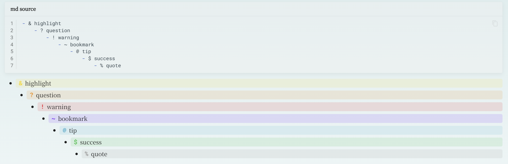

## MkDocs List Callouts

[中文](#mkdocs-list-callouts-zh-cn)

### Introduction

This plugin is inspired by [Obsidian List Callouts](https://github.com/mgmeyers/obsidian-list-callouts), providing a simple syntax to add callout-like highlighting styles to Markdown list items, enhancing document readability and aesthetics.



This plugin has been tested and works well with the [mkdocs-material](https://github.com/squidfunk/mkdocs-material/tree/master) theme. Compatibility with other themes has not been verified.

### Installation

This plugin is not yet published on PyPI. Please install it using the following method:

```bash
git clone https://github.com/EmergentTwilight/mkdocs-list-callouts.git
cd mkdocs-list-callouts
pip install .
```

### Configuration

#### Basic Configuration

After installation, add the following to your `mkdocs.yml` to enable the plugin with default styles:

```yaml
plugins:
  - list_callouts
```

#### How It Works

##### HTML Processing Mechanism

1. The plugin traverses the HTML document tree, locating all list items (`<li>` elements)
2. It checks if the text content of list items begins with specific symbols (such as `!`, `?`, `&`, `~`, `@`, `$`, `%`)
3. When a specific symbol is matched, the list item content is wrapped in a `<div>` element with special CSS classes
4. The special symbol marker is removed from the list item text

The plugin is implemented using Python Markdown's Treeprocessor mechanism, modifying the DOM tree structure during the conversion of Markdown to HTML.

Default symbol mappings are as follows:

| Symbol | CSS Class Name |
|--------|---------------|
| `&` | list-callouts-highlight |
| `?` | list-callouts-question |
| `!` | list-callouts-warning |
| `~` | list-callouts-bookmark |
| `@` | list-callouts-tip |
| `$` | list-callouts-success |
| `%` | list-callouts-quote |

##### CSS Style Injection

The configuration option `insert_default_css` is set to `True` by default, which automatically injects default CSS styles into the `<head>` element of the HTML document. The default style format example is shown below; for complete content, please refer to the [list-callouts-default.css](assets/list-callouts-default.css) file:

```css
/* & */
.list-callouts-highlight {
    background-color: rgba(246, 217, 67, calc(var(--md-list-callouts-bg-intensity-light) * 100%));
}

.list-callouts-highlight::before {
    content: "&";
    color: rgb(246, 217, 67);
}
```

#### Advanced Configuration

You can customize symbol mappings and whether to use default CSS styles in your `mkdocs.yml`:

```yaml
plugins:
  - list_callouts:
      symbol_map:
        "&": "highlight"  # Maps to CSS class name: list-callouts-highlight
        "?": "question"
        "!": "warning"
        "~": "bookmark"
        "@": "tip"
        "$": "success"
        "%": "quote"
      insert_default_css: false  # Set to false to disable default CSS style injection
```

`symbol_map` defines the mapping relationship between special symbols and CSS class names, while `insert_default_css` controls whether default CSS styles are automatically injected.

To use custom styles, you can copy and modify the [list-callouts-default.css](assets/list-callouts-default.css) file, set `insert_default_css` to `false`, and reference your custom CSS file in your `mkdocs.yml`.


## MkDocs List Callouts (zh-CN)

### 简介

本插件受到 [Obsidian List Callouts](https://github.com/mgmeyers/obsidian-list-callouts) 的启发，通过简单的语法为 Markdown 列表项添加类似 callout 的高亮样式，提升文档的可读性和美观度。


本插件已在 [mkdocs-material](https://github.com/squidfunk/mkdocs-material/tree/master) 主题下经过测试并可正常工作。与其他主题的兼容性尚未验证。

### 安装方法

本插件目前尚未发布至PyPI，请通过以下方式进行安装：

```bash
git clone https://github.com/EmergentTwilight/mkdocs-list-callouts.git
cd mkdocs-list-callouts
pip install .
```

### 配置说明

#### 基础配置

安装插件后，在 `mkdocs.yml` 中添加以下配置即可启用插件的默认样式：

```yaml
plugins:
  - list_callouts
```

#### 工作原理

##### HTML 处理机制

1. 插件遍历HTML文档树，定位所有列表项（`<li>` 元素）
2. 检查列表项的文本内容是否以特定符号开头（如 `!`、`?`、`&`、`~`、`@`、`$`、`%`）
3. 当匹配到特定符号时，将列表项内容包装在带有特殊CSS类的 `<div>` 元素中
4. 移除列表项文本中的特殊符号标记

插件通过 Python Markdown 的 Treeprocessor 机制实现，在 Markdown 转换为 HTML 的过程中修改 DOM 树结构。

默认支持的符号映射如下：

| 符号 | CSS类名 |
|------|---------|
| `&` | list-callouts-highlight |
| `?` | list-callouts-question |
| `!` | list-callouts-warning |
| `~` | list-callouts-bookmark |
| `@` | list-callouts-tip |
| `$` | list-callouts-success |
| `%` | list-callouts-quote |

##### CSS样式注入

配置项 `insert_default_css` 默认值为 `True`，此时插件会自动将默认CSS样式注入到HTML文档的 `<head>` 元素中。默认样式格式示例如下，完整内容可参考 [list-callouts-default.css](assets/list-callouts-default.css) 文件：

```css
/* & */
.list-callouts-highlight {
    background-color: rgba(246, 217, 67, calc(var(--md-list-callouts-bg-intensity-light) * 100%));
}

.list-callouts-highlight::before {
    content: "&";
    color: rgb(246, 217, 67);
}
```

#### 高级配置

您可以在 `mkdocs.yml` 中自定义符号映射关系及是否使用默认CSS样式：

```yaml
plugins:
  - list_callouts:
      symbol_map:
        "&": "highlight"  # 映射到CSS类名：list-callouts-highlight
        "?": "question"
        "!": "warning"
        "~": "bookmark"
        "@": "tip"
        "$": "success"
        "%": "quote"
      insert_default_css: false  # 设置为false可禁用默认CSS样式注入
```

`symbol_map` 定义了特殊符号与CSS类名的映射关系，`insert_default_css` 控制是否自动注入默认CSS样式。

如需使用自定义样式，可以复制并修改 [list-callouts-default.css](assets/list-callouts-default.css) 文件，将 `insert_default_css` 设置为 `false`，并在 `mkdocs.yml` 中引用您的自定义CSS文件。